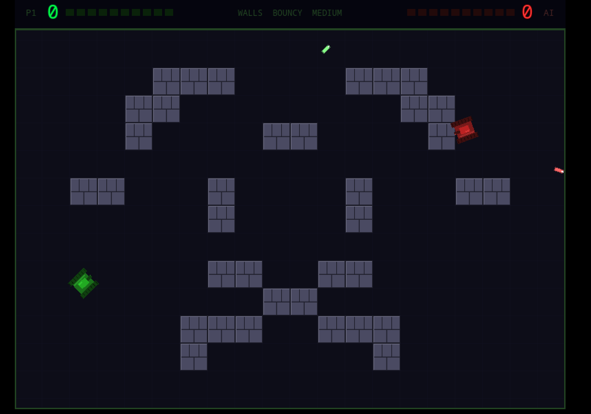
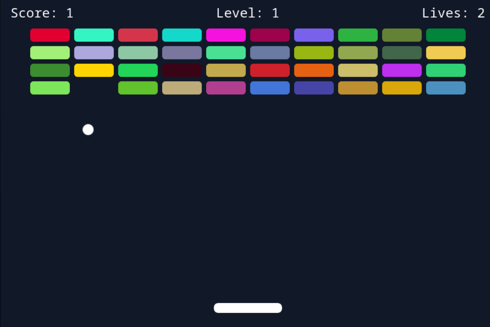

# VibeArcade

A spiffy collection of retro arcade games - I've used this project as an experiment to learn ways to leverage AI in game development workflows. (Thus the name!)

Games live under `games/` and are built independently via Vite. Games are launched from a static launcher page.




## Running Locally

```sh
# From the VibeArcade root
npm install       # installs all workspace deps (vite, phaser, etc.) once
npm run build     # builds all games + copies launcher to dist/
npm run serve     # serves dist/ at http://localhost:8080
```

## Project Structure

```
vibe-arcade/
├── index.html          # arcade launcher (edit GAMES array to add cards)
├── package.json        # workspace root — shared deps (vite, phaser) live here
├── shared/
│   └── touch-controller.js   # mobile joystick overlay, imported by every game
├── games/
│   ├── brickout/       # Vite + Phaser 3 game
│   ├── pong-game/      # Vite + Phaser 3 game
│   ├── roids/          # Vite + vanilla Canvas game
│   ├── sentra-pede/    # Vite + vanilla Canvas game
│   ├── face-invaders/  # Vite + vanilla Canvas game
│   └── conflict/       # Vite + Phaser 3 game (multi-scene)
└── dist/               # build output (git-ignored)
    ├── index.html
    ├── brickout/
    ├── pong-game/
    └── ...
```

Each game folder is an **npm workspace package**. Running `npm install` at the root hoists all shared dependencies (Vite, Phaser) into a single top-level `node_modules` — no duplicate installs.

## Architecture

### Every game follows the same pattern

```
games/my-game/
├── package.json      # { "name": "@arcade/my-game", "scripts": { "build": "vite build" } }
├── vite.config.js    # sets base URL and outDir
├── index.html        # entry point — one <script type="module" src="./src/main.js">
├── src/
│   └── main.js       # imports game logic + touch-controller
└── public/           # optional: static assets copied as-is (e.g. legacy game.js)
```

### touch-controller

`shared/touch-controller.js` is a self-contained IIFE that injects a virtual joystick overlay for mobile. Every game imports it as a side-effect:

```js
import '../../../shared/touch-controller.js'
```

Vite bundles it in. No manual copying needed.

### Vanilla Canvas games (roids, sentra-pede, face-invaders)

These games keep their raw `game.js` in `public/` (Vite copies it unchanged to `dist/`). The `src/main.js` only imports the touch-controller. No game logic changes were needed to integrate them into the build system.

### Phaser games (brickout, pong-game, conflict)

Phaser is imported from npm and bundled by Vite. The `conflict` game uses multiple scenes organised under `src/scenes/`, `src/ai/`, and `src/utils/` as proper ES modules.

---

## Adding a New Game

### 1. Create the game folder

```sh
mkdir games/my-game
```

### 2. Add `package.json`

```json
{
  "name": "@arcade/my-game",
  "private": true,
  "version": "0.0.0",
  "type": "module",
  "scripts": {
    "build": "vite build"
  }
}
```

No need to add `vite` or `phaser` as dependencies — they're inherited from the workspace root.

### 3. Add `vite.config.js`

```js
import { defineConfig } from 'vite'

export default defineConfig({
  base: '/my-game/',
  build: {
    outDir: '../../dist/my-game',
    emptyOutDir: true,
  },
})
```

### 4. Add `index.html`

```html
<!doctype html>
<html lang="en">
<head>
  <meta charset="UTF-8" />
  <meta name="viewport" content="width=device-width, initial-scale=1.0" />
  <title>My Game</title>
</head>
<body>
  <div id="app"></div>
  <script type="module" src="./src/main.js"></script>
</body>
</html>
```

### 5. Add `src/main.js`

Import your game code and the touch-controller:

```js
import Phaser from 'phaser'
import '../../../shared/touch-controller.js'

// your game setup here
new Phaser.Game({ ... })
```

Or for a vanilla Canvas game, put game logic in `public/game.js` (static copy), reference it from `index.html` as `<script src="./game.js">`, and keep `src/main.js` minimal:

```js
import '../../../shared/touch-controller.js'
```

### 6. Register the game in `index.html` (launcher)

Open the root `index.html` and add an entry to the `GAMES` array:

```js
{
  title: 'My Game',
  description: 'Short description.',
  controls: 'Arrow Keys + Space',
  path: '/my-game/',
},
```

Set `path: null` while still in development — the card will render as "Coming Soon".

### 7. Build and verify

```sh
npm run build
npm run serve
# open http://localhost:8080
```

The new game is automatically picked up by `npm run build` via npm workspaces — no changes to the root `package.json` scripts required.

---

## Deploying

After `npm run build`, the `dist/` folder is a fully static site. Drop it on any static host (Netlify, Vercel, GitHub Pages, S3, etc.) — no server-side logic required.
