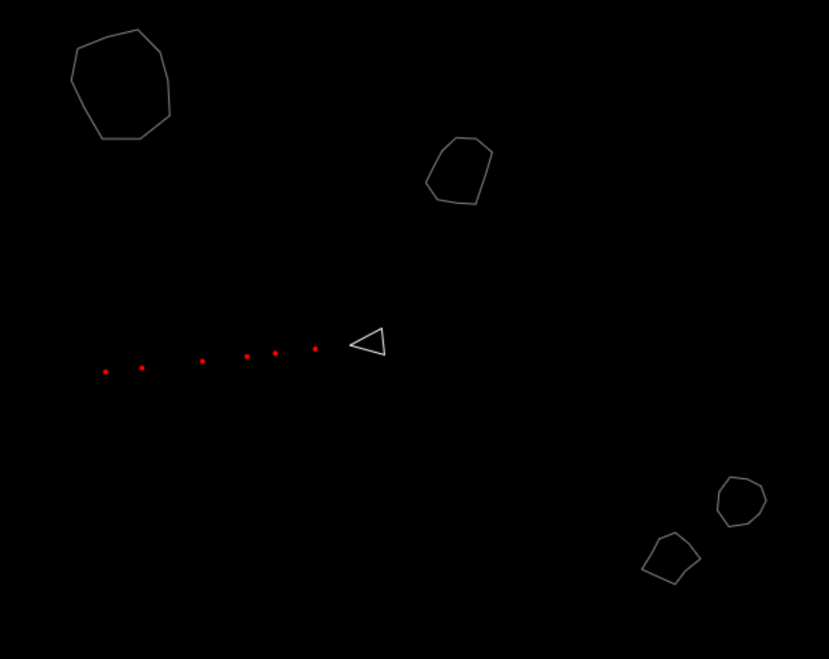

# AI_Roids Game

A simple Node.js application serving a browser-based Asteroids-like game.



## Setup

```bash
npm install
npm start
``` 

Open http://localhost:3000 in your browser.

## How to Play

Use the arrow keys: left/right rotate the ship, up arrow thrusts forward. Press spacebar to shoot projectiles. Destroy asteroids to score points; each hit gives +10. Sounds play when firing, explosions, and crashes. Collision with a rock ends the game.